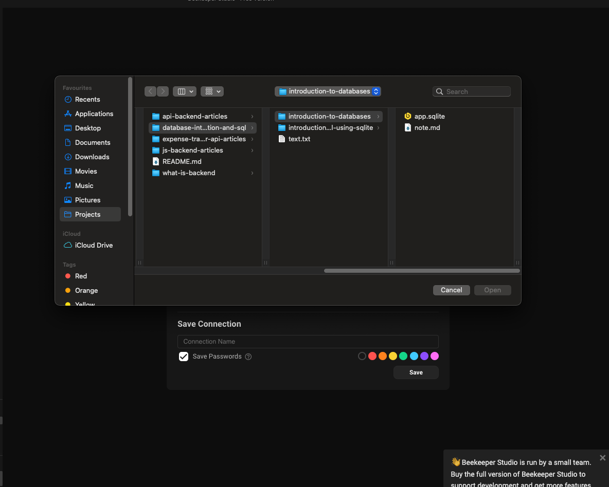
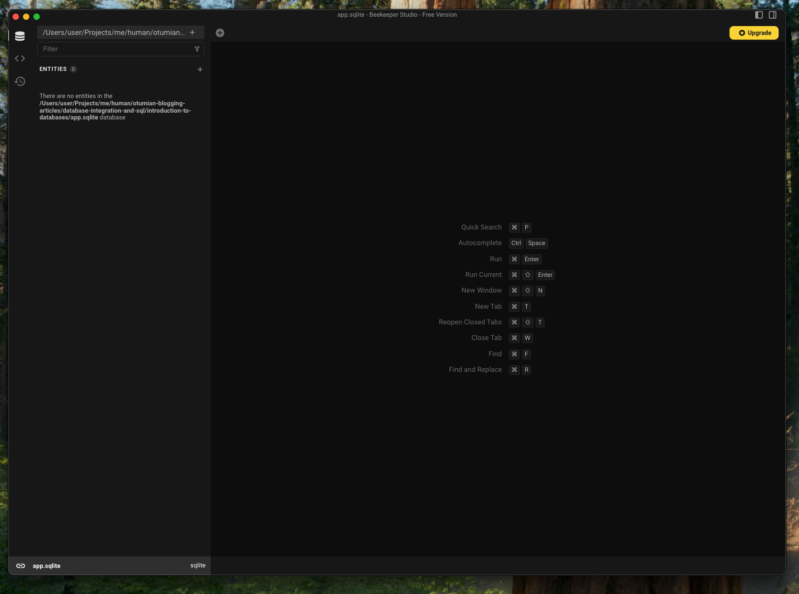
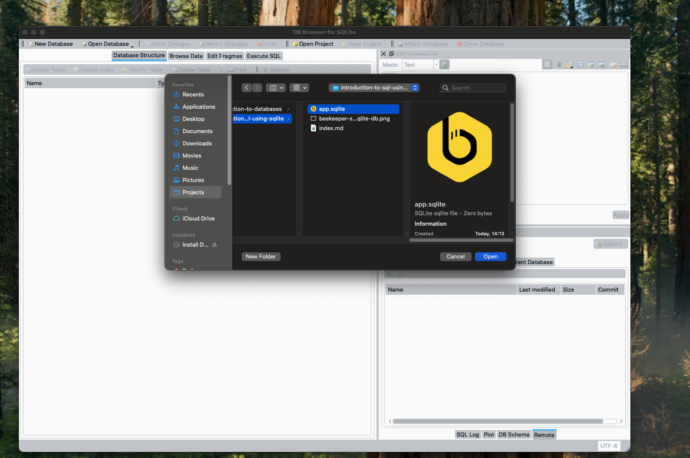
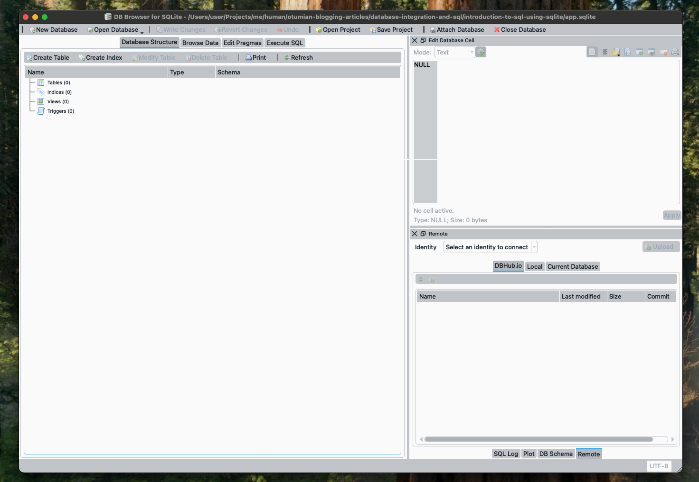

# Introduction to SQL using SQLite: Create Table

## Objectives

-   Create A SQLite Database
-   Import Database Into an SQL Client
-   SQLite Data Types
-   Constraints
-   Create Table

## Introduction

Previously, we discussed [Databases][previous-article] briefly, and in this excerpt, we will look into [SQL][sql].

In this excerpt, we will discuss creating tables.

## Create A SQLite Database

Creating a SQLite database is quite simple and straightforward. Create a file with a `.sqlite` extension. I will make one called `app.sqlite`. Open the newly created database with [Beekeeper Studio][beekeeper-studio] or [SQLite Browser][sqlite-browser].

In [Beekeeper Studio][beekeeper-studio], under the `New Connection` text, click on the drop-down, `Select a connection type...`. Choose `SQLite`. Now, click on the `Choose File` button and navigate to where your new SQLite database was created and choose it.

<br/>

<br/>
<br/>

Then click on `Connect`, and this should be what you will see. The database name will appear in the very lower left corner.

<br/>

<br/>
<br/>

In [SQLite Browser][sqlite-browser], you can create a new database with `New Database` or `Open Database`. We will open a new database. Click on the `Open Database` button, then navigate to where your new SQLite database was created and choose it.

<br/>

<br/>

After choosing it, the path to the selected database will be displayed in the title bar.

<br/>

<br/>
<br/>

## SQLite Data Types

In [JavaScript Essentials: Part 1][article-on-data-types], we discussed data types. In JavaScript, we have `Number`, `Boolean`, and `String`. In [SQLite][datatypes-in-sqlite] we have `INTEGER`, `REAL`, `TEXT`, `BLOB` and `NULL`.

-   `INTEGER` and `REAL` are `numbers`.
-   SQLite doesn't have a direct boolean. As we are all aware, a `boolean` value is either `true` or `false`, which can be represented as `1` or `0`. Hence, we can use an `INTEGER` for a `boolean`.
-   `TEXT` for `string`.
-   `BLOB` - "Binary Large Object" is used to store raw binary data such as images, files, etc.
-   `NULL` mean no data. When you fill a form and you omit or leave an input blank, it is `null`.

## Constraints

These are limitations, guards or characters of a field.

-   `NOT NULL`: `NULL` means no data, so `NOT NULL` means no `NULL` or data is expected or required.
-   `UNIQUE KEY`: A field declared unique will have a unique key; as such, any other values will have a different value. A common use case is for emails or usernames. You can't have two users on your platform with the same emails. Imagine you send a verification code to one, and the other also receives it.
-   `PRIMARY KEY`: A primary key uniquely identifies a row (record) in a table. Generally, as soon as a field is declared as a primary key, it becomes the primary key, regardless of its type. However, in most cases, the primary key is the row ID.
-   `DEFAULT`: It is the value to be used when no value is passed when creating the row. When a field is not `NOT NULL` constrained, the default value will be `NULL`.
-   `CHECK`: It is a condition that the value must satisfy.
-   `FOREIGN KEY`: It is a field used to reference another table. This is usually the primary key from the other table.

## Create Table

In [Introduction to Databases][introduction-to-databases], we talk about tables and what they are.

> To create a table in SQLite, we can either use the client ([Beekeeper studio][beekeeper-studio], [SQLite][sqlite-browser], etc as a GUI or script, a script that you will have to execute or directly on the terminal (with SQLite).

Generally, the format of creating a table is:

```sql
CREATE TABLE <TABLE_NAME> (
 field1 type [constraints],
 field2 type [constraints],
 ...,
 fieldN type [constraints]
);
```

### Human tables

Let's create a table for a human. Boring the knowledge from `JavaScript` - knowledge transfer, a human has some characteristics (properties), which will turn into fields (columns) in `SQL`. Let's say we have a human with a name, date of birth, social security number, email, cars and has a pet, just to keep it short.

Now, what will be the types of the following properties: `firstName`, `lastName`, `middleName`, `dateOfBirth`, `socialSecurityNumber`, `email`, `numberOfCars`, and `hasPet`?.

> In a real application or API, we don't save SSNs because it is very sensitive information.

The same types would translate to the field type in SQL(ite).

-   `firstName`, `lastName`, `middleName`, `socialSecurityNumber` and `email` are all `string`, as such they become `TEXT`
-   `dateOfBirth` is a `Date` object, but we don't have a direct date type in `SQLite`, so we can parse the `dateOfBirth` as a `string`, which means `dateOfBirth` can be saved as a `TEXT`. The `Date` object has a method, `valueOf()` or `getTime()`, with this, we can convert the date to a `number`, which we can either choose to store as an `INTEGER` or `TEXT`
-   `numberOfCars` is a `number` and so we will use an `INTEGER` type
-   `hasPet` is a `boolean`. Since there is no `boolean` type in SQLite, we can use `1` for `true` and `0` for `false`.

Since the subject of this is a human, we can name our table `human`.

> We can choose another format for the way we write out our field names. We will be using [Camel Casing][javascript-part-1]
> Double quote fields and single quote string/text values

```sql
CREATE TABLE "human" (
    "firstName" TEXT,
    "lastName" TEXT,
    "socialSecurityNumber" TEXT,
    "email" TEXT,
    "dateOfBirth" TEXT,
    "hasPet" INTEGER,
    "numberOfCars" INTEGER,
);
```

This table has no constraints. Apart from the email and SSN, which can be used to identify a unique human, we can also introduce a numeric field for record ID, `id`. This `id` will be a primary key.

```sql
CREATE TABLE "human" (
    "id" INTEGER PRIMARY KEY,
 ...
);
```

Now we have a primary key that will be used to identify a row. In practice, this `id`, which is an integer, must be different for each row to be a primary key. We can add one to the current `id` to get the next valid `id`. This will mean we will have to manually or programmatically take care of this and maintain it. However, the database has this constraint called `AUTOINCREMENT`, which will "automatically" increment the "ids" for uniqueness.

```sql
CREATE TABLE "human" (
    "id" INTEGER PRIMARY KEY AUTOINCREMENT,
 ...
);
```

> Primary keys are not null and unique, so we don't have to specify that
> Comment in Javascript is `//` or `/* */`. In SQL, it is `--` for a single-line comment

For the table we have above, by default, all the fields are nullable. This means they are not required. When a field is required (needed not to be null), then we have to specify that it is not null. `firstName`, `lastName`, `middleName`, `socialSecurityNumber` and `email` are fields whose values are required, so we will have to set them to `NOT NULL`. This way, the database will require that values be explicitly passed for these fields.

```sql
CREATE TABLE "human" (
    "id" INTEGER PRIMARY KEY AUTOINCREMENT,
    "firstName" TEXT NOT NULL,
    "lastName" TEXT NOT NULL,
    "socialSecurityNumber" TEXT NOT NULL,
    "email" TEXT NOT NULL,
    "dateOfBirth" TEXT,
    "hasPet" INTEGER,
    "numberOfCars" INTEGER,
);
```

`dateOfBirth` in our case here will be nullable; as such, we have to handle it appropriately. Not every human has a pet. In a case like this, we set the default value for `hasPet` to `false`. The same applies to `numberOfCars` but to `0`.

Why won't null be necessarily a "good" value?

```sql
CREATE TABLE "human" (
    ...
    "hasPet" INTEGER DEFAULT 0,
    "numberOfCars" INTEGER DEFAULT 0,
);
```

`socialSecurityNumber` and `email` are supposed to be unique values. We can programmatically handle this as well via code before the data reaches the database.

```sql
CREATE TABLE "human" (
 ...
    "socialSecurityNumber" TEXT NOT NULL UNIQUE,
    "email" TEXT NOT NULL UNIQUE,
 ...
);
```

You can ride the updated script via [Beekeeper studio][beekeeper-studio] or [SQLite][sqlite-browser]. We can also run this via the terminal.

```sh
$ sqlite3 app.sqlite
SQLite version 3.43.2 2023-10-10 13:08:14
Enter ".help" for usage hints.
sqlite>
```

> Even when not create, `sqlite3 <DATABASE NAME.sqlite>` will create a new SQLite database with name `<DATABASE NAME.sqlite>`
> Create a file with a `.sqlite` extension. I will create one called `app.sqlite`.

```sql
sqlite> CREATE TABLE "human" (
(x1...> "id" INTEGER PRIMARY KEY AUTOINCREMENT,
(x1...> "firstName" TEXT NOT NULL,
(x1...> "lastName" TEXT NOT NULL,
(x1...> "socialSecurityNumber" TEXT NOT NULL UNIQUE,
(x1...> "email" TEXT NOT NULL UNIQUE,
(x1...> "dateOfBirth" TEXT,
(x1...> "hasPet" INTEGER DEFAULT 0,
(x1...> "numberOfCars" INTEGER DEFAULT 0
(x1...> );
sqlite> .tables
human
sqlite>
```

> `CREATE`, `TABLE`, `INTEGER`, `DEFAULT`, etc can all be in lower case

> Analyze and create a table for the profile object below.

```js
const profile = {
    name: "John Doe",
    "date of birth": "2000-12-25",
    profession: "Software Engineer",
    "number of pets": 2,
    "weight of protein in grams": 12.5,
    "has a job": true,
};
```

> Share what you experience

## Resources

-   [sqlite-browser][sqlite-browser]
-   [beekeeper-studio][beekeeper-studio]
-   [nodejs-sqlite][nodejs-sqlite]
-   [nodejs-sqlite][nodejs-sqlite]
-   [introduction-to-databases][introduction-to-databases]
-   [sqlite-constraints][sqlite-constraints]
-   [w3s-sqlite-constraints][w3s-sqlite-constraints]
-   [sqlite-quirks][sqlite-quirks]
-   [javascript-part-1][javascript-part-1]

#

[sql]: https://www.w3schools.com/SQL
[sqlite-browser]: https://sqlitebrowser.org/dl
[beekeeper-studio]: https://www.beekeeperstudio.io
[nodejs-sqlite]: https://nodejs.org/api/sqlite.html
[previous-article]: https://dev.to/otumianempire/introduction-to-databases-2o5g
[datatypes-in-sqlite]: https://www.sqlite.org/datatype3.html
[article-on-data-types]: https://dev.to/otumianempire/javascript-essentials-part-1-39c1
[introduction-to-databases]: https://dev.to/otumianempire/introduction-to-databases-2o5g
[sqlite-constraints]: https://sqlite.org/syntax/column-constraint.html
[w3s-sqlite-constraints]: https://www.w3schools.com/SQL/sql_constraints.asp
[sqlite-quirks]: https://www.sqlite.org/quirks.html
[javascript-part-1]: https://dev.to/otumianempire/javascript-essentials-part-1-39c1
