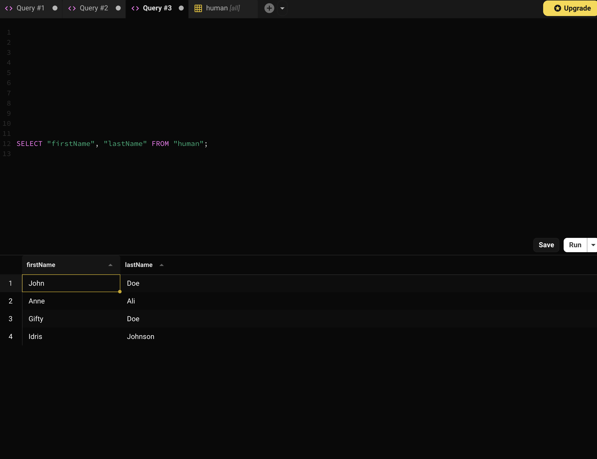
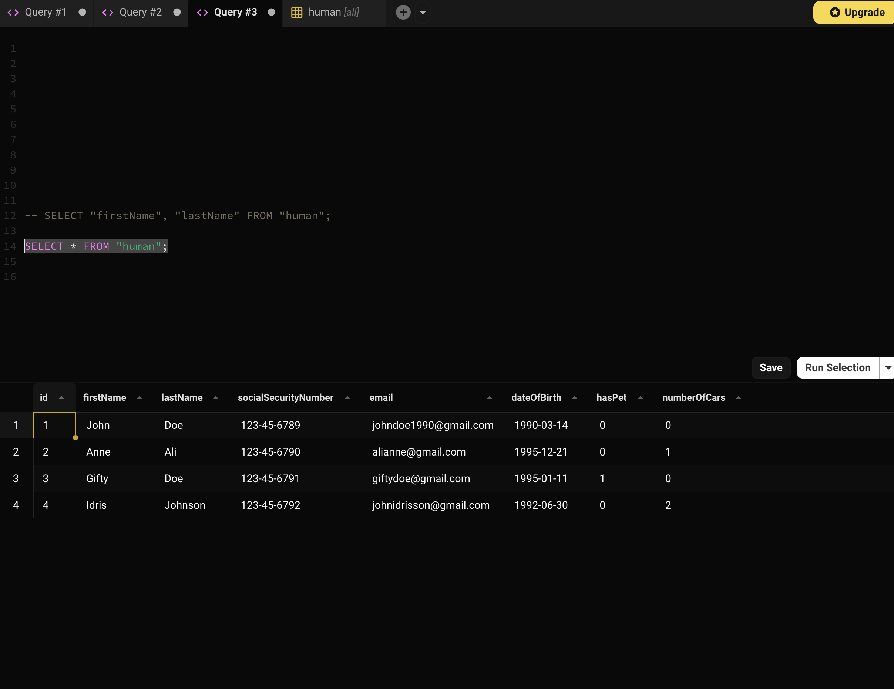

# Introduction to SQL using SQLite: Data Manipulation

## Objectives

-   DROP TABLE
-   INSERT
-   SELECT
-   FILTERS
-   FUNCTIONS
-   UPDATE
-   DELETE

## Introduction

We discussed that, to create a table for the object,

```js
const profile = {
    name: "John Doe",
    "date of birth": "2000-12-25",
    profession: "Software Engineer",
    "number of pets": 2,
    "weight of protein in grams": 12.5,
    "has a job": true,
};
```

We would have to analyse it and design a table that meets the requirements of our system, building on the knowledge we already have in JavaScript.

| property                     | JS        | SQL       | Constraint   |
| ---------------------------- | --------- | --------- | ------------ |
| `name`                       | `string`  | `TEXT`    | `NOT NULL`   |
| `date of birth`              | `Date`    | `TEXT`    |              |
| `profession`                 | `string`  | `TEXT`    | `DEFAULT ''` |
| `number of pets`             | `number`  | `INTEGER` | `DEFAULT 0`  |
| `weight of protein in grams` | `number`  | `INTEGER` | `DEFAULT 0`  |
| `has a job`                  | `boolean` | `INTEGER` | `DEFAULT 0`  |

This would logically boil down to something like:

```SQL
CREATE TABLE "profile" (
    "id" INTEGER PRIMARY KEY AUTOINCREMENT,
    "name" TEXT NOT NULL,
    "dateOfBirth" TEXT,
    "profession" TEXT DEFAULT '',
    "numberOfPets" INTEGER DEFAULT 0,
    "weightOfProteinInGrams" INTEGER DEFAULT 0,
    "hasJob" INTEGER DEFAULT 0
);
```

In this section, we are going to focus on data manipulation, _CRUD_. Check out [Request And Response][request-and-response], where we discussed _CRUD_ and [Basic Crud Api With Express][basic-crud-api-with-express], where we started building a _CRUD_ application.

We will borrow a table here.

| **CRUD** | **HTTP VERBS** | **SQL**  |
| -------- | -------------- | -------- |
| `CREATE` | `POST`         | `INSERT` |
| `READ`   | `READ`         | `SELECT` |
| `UPDATE` | `PUT`          | `UPDATE` |
| `DELETE` | `DELETE`       | `DELETE` |

## DROP TABLE

First things first, if you can create, you should "un"-create. To "un"-create a table, we have to "drop" it. General syntax is:

```SQL
DROP TABLE <TABLE_NAME>;
```

For the _profile_ table or _human_ table, we can drop it by executing the script, `DROP TABLE "profile";` OR `DROP TABLE "human";`.

> `;` signifies the end of the script (that line or snippet).

> Know that this action is not reversible in most situations.

## INSERT

Syntax for `INSERT` is generally,

```SQL
INSERT INTO <TABLE_NAME> (<column1>,<column2>,...,<columnN>,) VALUES (<value1>, <value2>, ...,<valueN>);
```

This is the snippet for creating the "human" table.

```SQL
CREATE TABLE "human" (
    "id" INTEGER PRIMARY KEY AUTOINCREMENT,
    "firstName" TEXT NOT NULL,
    "lastName" TEXT NOT NULL,
    "socialSecurityNumber" TEXT NOT NULL UNIQUE,
    "email" TEXT NOT NULL UNIQUE,
    "dateOfBirth" TEXT,
    "hasPet" INTEGER DEFAULT 0,
    "numberOfCars" INTEGER DEFAULT 0
);
```

Let's create a row for _John Doe_ with SSN, _123-45-6789_, who has no pet and no car, born on _14th of March, 1990_, with _johndoe1990@gmail.com_ as email.

```SQL
INSERT INTO "human"
 ("firstName", "lastName", "socialSecurityNumber", "email", "dateOfBirth", "hasPet", "numberOfCars")
VALUES
 ('John', 'Doe', '123-45-6789', 'johndoe1990@gmail.com', '1990-03-14', 0, 0);
```

This will create a unique row for _John Doe_ with _123-45-6789_ as SSN.

Do you think we can create another row with the same details? Try it.

> You should get `UNIQUE constraint failed: human.email`.

Create two more "human" records.

We can create more rows at once, bulk insert, by

```SQL
INSERT INTO <TABLE_NAME>
 (<column1>,<column2>,...,<columnN>,)
VALUES
 (<value1>, <value2>, ...,<valueN>),
 (<value1>, <value2>, ...,<valueN>),
 (<value1>, <value2>, ...,<valueN>),
 (<value1>, <value2>, ...,<valueN>),
 ...
 (<value1>, <value2>, ...,<valueN>);
```

## SELECT

The syntax for a `SELECT` statement is:

```SQL
SELECT <FIELDS TO SELECT> FROM <TABLE NAME>;
```

So let's say we want the `firstName` and `lastName` columns from the `human` table, then will do

```SQL
SELECT "firstName", "lastName" FROM "human";
```

This is how my output looks from the terminal.

```sh
user$ sqlite3 app.sqlite
SQLite version 3.43.2 2023-10-10 13:08:14
Enter ".help" for usage hints.
sqlite> SELECT "firstName", "lastName" FROM "human";
John|Doe
Anne|Ali
Gifty|Doe
Idris|Johnson
sqlite>
```

In [beekeeper-studio][beekeeper-studio], it looks "pretty"

<br/>

<br/>
<br/>

For the above output, these are the inserts.

```SQL
INSERT INTO "human"
 ("firstName", "lastName", "socialSecurityNumber", "email", "dateOfBirth", "hasPet", "numberOfCars")
VALUES
 ('Anne', 'Ali', '123-45-6790', 'alianne@gmail.com', '1995-12-21', 0, 1),
 ('Gifty', 'Doe', '123-45-6791', 'giftydoe@gmail.com', '1995-01-11', 1, 0),
 ('Idris', 'Johnson', '123-45-6792', 'johnidrisson@gmail.com', '1992-06-30', 0, 2);
```

When selecting a column for display, you have to account for the use of the column. When the client doesn't have that column, don't send it.

There is another way to select all the columns from a table, which is useful at times. This can be done by replacing all the with `*`, an asterisk.

```SQL
SELECT * FROM "human";
```

The response is quite similar, but with all the fields this time.

<br/>

<br/>
<br/>

SQLite can be configured to look "pretty". Check out [sqlite-dot-commands]

We can use the column mode

```SQL
sqlite> .mode column
sqlite> SELECT * FROM "human";
id  firstName  lastName  socialSecurityNumber  email                   dateOfBirth  hasPet  numberOfCars
--  ---------  --------  --------------------  ----------------------  -----------  ------  ------------
1 John       Doe       123-45-6789 johndoe1990@gmail.com   1990-03-14   0       0
2 Anne       Ali       123-45-6790 alianne@gmail.com       1995-12-21   0       1
3 Gifty      Doe       123-45-6791 giftydoe@gmail.com      1995-01-11   1       0
4 Idris      Johnson   123-45-6792 johnidrisson@gmail.com  1992-06-30   0       2
sqlite>
```

We also have the box mode

```SQL
sqlite> .mode box
sqlite> SELECT * from "human";
┌────┬───────────┬──────────┬──────────────────────┬────────────────────────┬─────────────┬────────┬──────────────┐
│ id │ firstName │ lastName │ socialSecurityNumber │         email          │ dateOfBirth │ hasPet │ numberOfCars │
├────┼───────────┼──────────┼──────────────────────┼────────────────────────┼─────────────┼────────┼──────────────┤
│ 1 │ John      │ Doe      │ 123-45-6789 │ johndoe1990@gmail.com  │ 1990-03-14 │ 0 │ 0 │
│ 2 │ Anne      │ Ali      │ 123-45-6790 │ alianne@gmail.com      │ 1995-12-21 │ 0 │ 1 │
│ 3 │ Gifty     │ Doe      │ 123-45-6791 │ giftydoe@gmail.com     │ 1995-01-11 │ 1 │ 0 │
│ 4 │ Idris     │ Johnson  │ 123-45-6792 │ johnidrisson@gmail.com │ 1992-06-30 │ 0 │ 2 │
└────┴───────────┴──────────┴──────────────────────┴────────────────────────┴─────────────┴────────┴──────────────┘
```

With this we have `.exit` to exit the SQLite runtime-environment (on the cli).

## FILTERS

The idea about filters here, is to not unnecessarily select all the roles that we. We want to be able to select based on conditions and some particular amount at a time.

In the `SELECT` section, we know how to select only the fields we by passing the column's name.

We will need more rows here. You can download or access [more data](./more-data.sql) for insert. You can copy the content and paste it into any of the SQLite clients.

When the [more data](./more-data.sql) SQL file is download, we can insert its content by running this commend on SQLite

```sh
sqlite> .read more-data.sql
sqlite>
```

> Put `more-data.sql` in the same folder as `app.sqlite` or pass the path to `more-data.sql`

### WHERE CLAUSE

The `WHERE` clause can be used to filter (conditional selection). This takes on the same syntax as `SELECT` with `WHERE`.

```SQL
SELECT <FIELDS TO SELECT> FROM <TABLE NAME> WHERE <CONDITION FOR THE SELECTION>;
```

-   Let's find humans that have pets. This means that we are interested in humans with the `hasPet` column to be `1`. To do this we use `=`.

```SQL
   SELECT * FROM "human" WHERE "hasPet" = 1;
```

-   So the `=` means is or equal-to. Unlike Javascript, `=`, single equal-to operator is used for assignment, whilst `==` or `===` is for equality check.
-   In [javascript-part-four][javascript-part-four], we also discussed these operators
-   Is not equal to `!=`, so we can have `<`, `>`, `<=`, `>=`
-   Try selecting humans that have at least `2` cars
-   We have `&&` as `AND` in Javascript, in SQL, it is `AND`. Same as `||` which is `OR`. With these we can have compound conditions.
-   Let's find humans that have a pet and at least two cars.

```SQL
   SELECT * FROM "human" WHERE "hasPet" = 1  AND "numberOfCars" >= 2;
```

-   There is `BETWEEN` is used to find rows in ranges, `"<COLUMN NAME> BETWEEN <START VALUE> AND <END VALUE>`. Let's find humans whose IDs are between ranges of 3 and 10.

```SQL
   SELECT * FROM "human" WHERE "id" BETWEEN 3 AND 10;
```

-   We can find humans who don't have pets but have between 2 to 4 cars.

```SQL
   SELECT * FROM "human" WHERE  "hasPet" = 0 AND ("numberOfCars" BETWEEN 2 AND 4);
```

-   When "things" are getting complicated, wrap "things" in brackets and you will be fine.
-   We can find the rows of human whose IDs are in the array, `[2,5,8,9]` by using the `IN` operator. For this, we do, `"<COLUMN NAME> IN (value1, value2, ..., valueN)`.

```SQL
   SELECT * FROM "human" WHERE "id" IN (1,2,5,8,9);
```

-   We can also have a group of conditions and then negate them by using the `NOT` operator.

```SQL
   -- negate IN
   SELECT * FROM "human" WHERE "id" NOT IN (1,2,5,8,9);

   -- negate BETWEEN
   SELECT * FROM "human" WHERE "numberOfCars" NOT BETWEEN 1 AND 3;

   --negate compound conditions
   SELECT * FROM "human" WHERE NOT ("hasPet" = 0 AND ("numberOfCars" BETWEEN 2 AND 4));
```

### ORDER BY

By default, the rows are returned in a ascending order of ID. The rows are return in the order of the first created record to the latest. From the lowest to to the highest This is done by `ORDER BY <COLUMN NAME> [DESC|ASC]`.

-   Let's see the default order, `SELECT * FROM "human" WHERE "id" IN (1,2,5,8,9);` Check the order order of the IDs

```sh
   sqlite> SELECT * FROM "human" WHERE "id" IN (1,2,5,8,9);
   ┌────┬───────────┬──────────┬──────────────────────┬──────────────────────────┬─────────────┬────────┬──────────────┐
   │ id │ firstName │ lastName │ socialSecurityNumber │          email           │ dateOfBirth │ hasPet │ numberOfCars │
   ├────┼───────────┼──────────┼──────────────────────┼──────────────────────────┼─────────────┼────────┼──────────────┤
   │ 1  │ John      │ Doe      │ 123-45-6789          │ johndoe1990@gmail.com    │ 1990-03-14  │ 0      │ 0            │
   │ 2  │ Anne      │ Ali      │ 123-45-6790          │ alianne@gmail.com        │ 1995-12-21  │ 0      │ 1            │
   │ 5  │ Elarais   │ Kaelon   │ 123-45-6797          │ elarais.kaelon@gmail.com │ 1991-07-22  │ 1      │ 1            │
   │ 8  │ Peridot   │ Valor    │ 123-45-6800          │ peridot.valor@gmail.com  │ 1975-03-10  │ 1      │ 3            │
   │ 9  │ Aelis     │ Caspian  │ 123-45-6801          │ aelis.caspian@gmail.com  │ 1996-12-28  │ 0      │ 1            │
   └────┴───────────┴──────────┴──────────────────────┴──────────────────────────┴─────────────┴────────┴──────────────┘
```

-   We can switch the order to `DESC` by passing, `ORDER BY "id" DESC`. `SELECT * FROM "human" WHERE "id" IN (1,2,5,8,9) ORDER BY "id" DESC;`

```SQL
   sqlite> SELECT * FROM "human" WHERE "id" IN (1,2,5,8,9) ORDER BY "id" DESC;
   ┌────┬───────────┬──────────┬──────────────────────┬──────────────────────────┬─────────────┬────────┬──────────────┐
   │ id │ firstName │ lastName │ socialSecurityNumber │          email           │ dateOfBirth │ hasPet │ numberOfCars │
   ├────┼───────────┼──────────┼──────────────────────┼──────────────────────────┼─────────────┼────────┼──────────────┤
   │ 9 │ Aelis     │ Caspian  │ 123-45-6801 │ aelis.caspian@gmail.com  │ 1996-12-28 │ 0 │ 1 │
   │ 8 │ Peridot   │ Valor    │ 123-45-6800 │ peridot.valor@gmail.com  │ 1975-03-10 │ 1 │ 3 │
   │ 5 │ Elarais   │ Kaelon   │ 123-45-6797 │ elarais.kaelon@gmail.com │ 1991-07-22 │ 1 │ 1 │
   │ 2 │ Anne      │ Ali      │ 123-45-6790 │ alianne@gmail.com        │ 1995-12-21 │ 0 │ 1 │
   │ 1 │ John      │ Doe      │ 123-45-6789 │ johndoe1990@gmail.com    │ 1990-03-14 │ 0 │ 0 │
   └────┴───────────┴──────────┴──────────────────────┴──────────────────────────┴─────────────┴────────┴──────────────┘
```

## FUNCTIONS

SQLite (SQL) supports functions for computing sum, `SUM`, count, `COUNT`, average, `AVG`, to find maximum, `MAX`, and minimum, `MIN`.

-   Let's sum the number of cars humans with pet have.

```SQL
   SELECT SUM("numberOfCars") FROM "human" WHERE "hasPet" = 1;
```

-   The response to this is a little different from what we have seen so far

```sh
   sqlite> SELECT SUM("numberOfCars") FROM "human" WHERE "hasPet" = 1;
   ┌─────────────────────┐
   │ SUM("numberOfCars") │
   ├─────────────────────┤
   │ 15                  │
   └─────────────────────┘
```

-   Does `SUM` on non-numeric fields?
-   Let's count the number of humans with a pet. `SELECT * FROM "human" WHERE "hasPet" = 1;` returns rows of humans with pet.

```sh
   sqlite> SELECT COUNT(*) FROM "human" WHERE "hasPet" = 1;
   ┌──────────┐
   │ COUNT(*) │
   ├──────────┤
   │ 14       │
   └──────────┘
```

-   `COUNT("id")` will return the same response as `COUNT(*)` since it is the number of rows returned that countered.
-   We can find the average, `AVG`, in the same way as we did for `SUM`

```sh
   sqlite> SELECT AVG("numberOfCars") FROM "human" WHERE "hasPet" = 1;
   ┌─────────────────────┐
   │ AVG("numberOfCars") │
   ├─────────────────────┤
   │ 1.07142857142857    │
   └─────────────────────┘
```

-   `MIN` and `MAX` basically returns the minimum and maximum.
-   The default ordering is in `ASC` using the row's id.

```sh
   sqlite> SELECT * FROM "human" WHERE "hasPet" = 1;
   ┌────┬───────────┬──────────┬──────────────────────┬──────────────────────────┬─────────────┬────────┬──────────────┐
   │ id │ firstName │ lastName │ socialSecurityNumber │          email           │ dateOfBirth │ hasPet │ numberOfCars │
   ├────┼───────────┼──────────┼──────────────────────┼──────────────────────────┼─────────────┼────────┼──────────────┤
   │ 3  │ Gifty     │ Doe      │ 123-45-6791          │ giftydoe@gmail.com       │ 1995-01-11  │ 1      │ 0            │
   │ 5  │ Elarais   │ Kaelon   │ 123-45-6797          │ elarais.kaelon@gmail.com │ 1991-07-22  │ 1      │ 1            │
   │ 7  │ Indigo    │ Rylanx   │ 123-45-6799          │ indigo.rylanx@gmail.com  │ 2001-09-01  │ 1      │ 0            │
   │ 8  │ Peridot   │ Valor    │ 123-45-6800          │ peridot.valor@gmail.com  │ 1975-03-10  │ 1      │ 3            │
   │ 10 │ Nyxus     │ Joveus   │ 123-45-6802          │ nyxus.joveus@gmail.com   │ 1984-06-03  │ 1      │ 2            │
   │ 12 │ Daxus     │ Onyx     │ 123-45-6804          │ daxus.onyx@gmail.com     │ 1970-02-20  │ 1      │ 1            │
   │ 14 │ Quillon   │ Lior     │ 123-45-6806          │ quillon.lior@gmail.com   │ 1997-04-25  │ 1      │ 1            │
   │ 15 │ Soren     │ Wren     │ 123-45-6807          │ soren.wren@gmail.com     │ 2003-01-07  │ 1      │ 0            │
   │ 17 │ Faelan    │ Zenith   │ 123-45-6809          │ faelan.zenith@gmail.com  │ 1986-05-30  │ 1      │ 1            │
   │ 19 │ Lumina    │ Saga     │ 123-45-6811          │ lumina.saga@gmail.com    │ 1972-03-29  │ 1      │ 2            │
   │ 21 │ Eira      │ Myrddin  │ 123-45-6813          │ eira.myrddin@gmail.com   │ 1998-05-19  │ 1      │ 1            │
   │ 23 │ Kestrel   │ Garnet   │ 123-45-6815          │ kestrel.garnet@gmail.com │ 2000-08-23  │ 1      │ 0            │
   │ 25 │ Solara    │ Roux     │ 123-45-6817          │ solara.roux@gmail.com    │ 1990-09-11  │ 1      │ 1            │
   │ 27 │ Aether    │ Phaedra  │ 123-45-6819          │ aether.phaedra@gmail.com │ 1995-01-05  │ 1      │ 2            │
   └────┴───────────┴──────────┴──────────────────────┴──────────────────────────┴─────────────┴────────┴──────────────┘
```

-   If we want to find the minimum or maximum, we'd have to sort the rows.

```sh
   sqlite> SELECT * FROM "human" WHERE "hasPet" = 1 ORDER BY "numberOfCars" DESC;
   ┌────┬───────────┬──────────┬──────────────────────┬──────────────────────────┬─────────────┬────────┬──────────────┐
   │ id │ firstName │ lastName │ socialSecurityNumber │          email           │ dateOfBirth │ hasPet │ numberOfCars │
   ├────┼───────────┼──────────┼──────────────────────┼──────────────────────────┼─────────────┼────────┼──────────────┤
   │ 8  │ Peridot   │ Valor    │ 123-45-6800          │ peridot.valor@gmail.com  │ 1975-03-10  │ 1      │ 3            │
   │ 10 │ Nyxus     │ Joveus   │ 123-45-6802          │ nyxus.joveus@gmail.com   │ 1984-06-03  │ 1      │ 2            │
   │ 19 │ Lumina    │ Saga     │ 123-45-6811          │ lumina.saga@gmail.com    │ 1972-03-29  │ 1      │ 2            │
   │ 27 │ Aether    │ Phaedra  │ 123-45-6819          │ aether.phaedra@gmail.com │ 1995-01-05  │ 1      │ 2            │
   │ 5  │ Elarais   │ Kaelon   │ 123-45-6797          │ elarais.kaelon@gmail.com │ 1991-07-22  │ 1      │ 1            │
   │ 12 │ Daxus     │ Onyx     │ 123-45-6804          │ daxus.onyx@gmail.com     │ 1970-02-20  │ 1      │ 1            │
   │ 14 │ Quillon   │ Lior     │ 123-45-6806          │ quillon.lior@gmail.com   │ 1997-04-25  │ 1      │ 1            │
   │ 17 │ Faelan    │ Zenith   │ 123-45-6809          │ faelan.zenith@gmail.com  │ 1986-05-30  │ 1      │ 1            │
   │ 21 │ Eira      │ Myrddin  │ 123-45-6813          │ eira.myrddin@gmail.com   │ 1998-05-19  │ 1      │ 1            │
   │ 25 │ Solara    │ Roux     │ 123-45-6817          │ solara.roux@gmail.com    │ 1990-09-11  │ 1      │ 1            │
   │ 3  │ Gifty     │ Doe      │ 123-45-6791          │ giftydoe@gmail.com       │ 1995-01-11  │ 1      │ 0            │
   │ 7  │ Indigo    │ Rylanx   │ 123-45-6799          │ indigo.rylanx@gmail.com  │ 2001-09-01  │ 1      │ 0            │
   │ 15 │ Soren     │ Wren     │ 123-45-6807          │ soren.wren@gmail.com     │ 2003-01-07  │ 1      │ 0            │
   │ 23 │ Kestrel   │ Garnet   │ 123-45-6815          │ kestrel.garnet@gmail.com │ 2000-08-23  │ 1      │ 0            │
   └────┴───────────┴──────────┴──────────────────────┴──────────────────────────┴─────────────┴────────┴──────────────┘
```

-   By eye inspection or comparing the order of "numberOfCars" column, record with ID, 8, has highest number of cars and 23 has the lowest.
-   For `MIN` and `MAX`

```sh
   sqlite> SELECT MIN("numberOfCars") FROM "human" WHERE "hasPet" = 1;
   ┌─────────────────────┐
   │ MIN("numberOfCars") │
   ├─────────────────────┤
   │ 0                   │
   └─────────────────────┘
   sqlite> SELECT MAX("numberOfCars") FROM "human" WHERE "hasPet" = 1;
   ┌─────────────────────┐
   │ MAX("numberOfCars") │
   ├─────────────────────┤
   │ 3                   │
   └─────────────────────┘
```

-   How do we get the maximum number of cars among all the records?

## UPDATE

The general syntax for an update looks like

```SQL
UPDATE <TABLE NAME> SET <COLUMN 1> = <VALUE 1>, <COLUMN 2> = <VALUE 2>,..., <COLUMN N> = <VALUE N> WHERE <CONDITIONS>;
```

The `WHERE` clause is optional.

There are two siblings, _John_ and _Gifty Doe_. _Gifty_ has a pet but _John_ doesn't. _John_ must have something. Let's updates _John_'s row to increment the number of cars he has to _1_. _John_'s ID is _1_. You can do this for any user.

```SQL
UPDATE "human" SET "numberOfCars" = 1 WHERE "id" = 1;
```

When human with ID _1_ is selected, the _numberOfCars_ column would have been updated to _1_.

Try updating the `email` of human with `email`, _giftydoe@gmail.com_ to _giftydoe1995@gmail.com_.

What do you think will happen when no `WHERE` clause is passed?

> `=` is used as assignment operator here.

## DELETE

The general syntax of `DELETE` is similar that of `UPDATE`.

```SQL
DELETE FROM <TABLE NAME> WHERE <CONDITIONS>;
```

The rows which match the condition are deleted. When there are no conditions or `WHERE` clauses, this action will affect the entire rows. As such use with caution.

-   `SELECT` humans with no pet and no cars.
-   How many are they? Use the `COUNT` function.
-   Let's `DELETE` these records.

```SQL
   DELETE FROM "human" WHERE "numberOfCars" = 0 AND "hasPet" = 0;
```

-   Are there any records with no cars and no pet? Use the `COUNT` function.

## SUMMARY

-   We can delete a table with `DROP <TABLE NAME>;`
-   We can insert with `INSERT INTO <TABLE NAME> (...cols) VALUES (...vals);`
-   Using the `SELECT` and `WHERE`, we can list records that meets a certain criteria
-   We can use SQL functions to reduce the number data manipulation we have to execute
-   We can update a record by, `UPDATE <TABLE NAME> SET <col> = <val> WHERE <CONDITION>`
-   We can delete a record by, `DELETE FROM <TABLE NAME> WHERE <CONDITION>`
-   When we use `UPDATE` and `DELETE`, where no `WHERE` clause is passed, these action will affect all the records

#

[request-and-response]: https://dev.to/otumianempire/request-and-response-1031
[basic-crud-api-with-express]: https://dev.to/otumianempire/basic-crud-api-with-express-2eoc
[beekeeper-studio]: https://www.beekeeperstudio.io
[sqlite-dot-commands]: https://sqlite.org/cli.html
[javascript-part-four]: https://dev.to/otumianempire/javascript-essentials-part-4-2ne6
